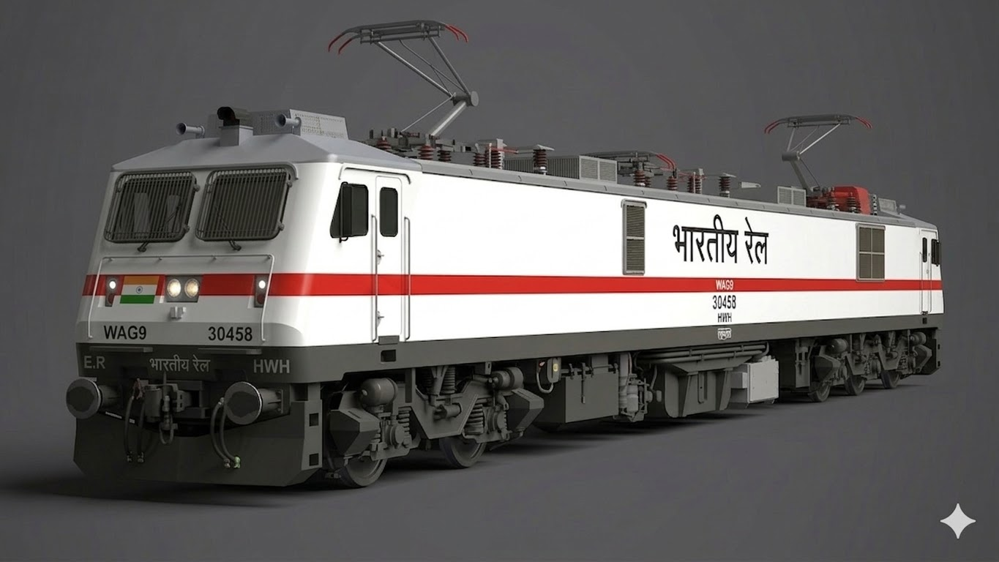

# 🚂 RailOptima — Railway Signal Optimization System

**An AI-powered real-time railway signal optimization system that uses
Machine Learning to minimize train delays and maximize network throughput.**

---

## 👨‍💻 Developed By

| Developer | Role |
|-----------|------|
| **Gourab Dey** | Project Lead & ML Engineer |
| **Chitradeep Das** | Frontend Developer |
| **Sandipan Karmakar** | Backend Developer |
| **Sandip Mandal** | ML Model & Data Engineer |

---

## 📋 Table of Contents

- [Overview](#-overview)
- [Features](#-features)
- [System Architecture](#-system-architecture)
- [Tech Stack](#-tech-stack)
- [ML Models Used](#-ml-models-used)
- [Project Structure](#-project-structure)
- [Getting Started](#-getting-started)
- [How It Works](#-how-it-works)
- [API Endpoints](#-api-endpoints)
- [Screenshots](#-screenshots)
- [License](#-license)

---

## 🔍 Overview

RailOptima is a full-stack intelligent railway management system that simulates
a real railway network and uses Artificial Intelligence to optimize signal
states in real time. The system continuously monitors train positions, signal
aspects, switch positions, and delay accumulations, and when the operator
requests optimization it runs the current network state through a trained
Machine Learning pipeline to generate the safest and most efficient set of
signal and switch changes that will reduce delays and improve throughput across
the entire network.

The system is built on a three-tier architecture consisting of a React
TypeScript frontend for simulation and visualization, an Express Node.js
backend for API orchestration and fallback handling, and a Python Flask ML
service hosting the trained Random Forest, Gradient Boosting, and PPO
Reinforcement Learning models.

---

## ✨ Features
